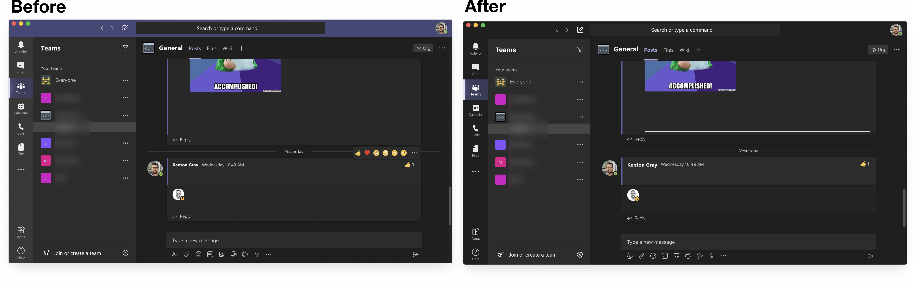

Teams Mac app uses Microsoft fonts and feels very foreign on MacOS. This drives me crazy so I created some CSS hacks to tweak it. 

# How To Use
* Copy `script.js` into your clipboard
* Mash the Teams icon 7 times 
* Use the newly appearing Developer menu Dev Tools ->  Open Dev Tools (Main Window)
* Paste script 
* Relax, your Teams now uses the system font (and has a few other tweaks)

# Random Thoughts
Since it is an electron app it is possible to inject CSS. Initially I used the very clever python scripts that @dany74q setup.
https://github.com/dany74q/microsoft-teams-rtl-runner, but it causes some weirdness. I may look into this more. I ended up settling with the developer menu since I don't restart Teams much it doesn't really bother me (yet). I attempted to actually inject it into the app itself but it seems that it undoes my changes.

Anyways hope this helps someone else annoyed, open to additional tweaks or ideas to inject the script automatically.
